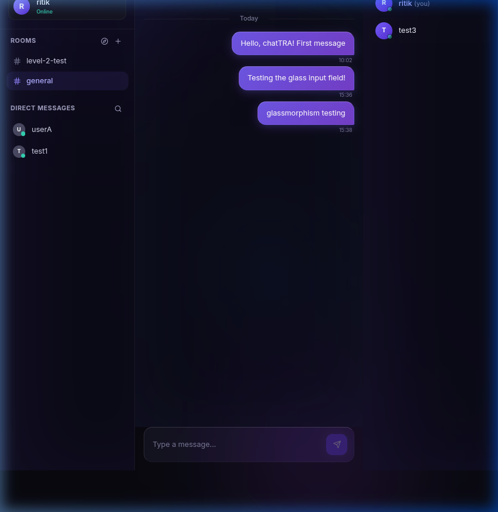
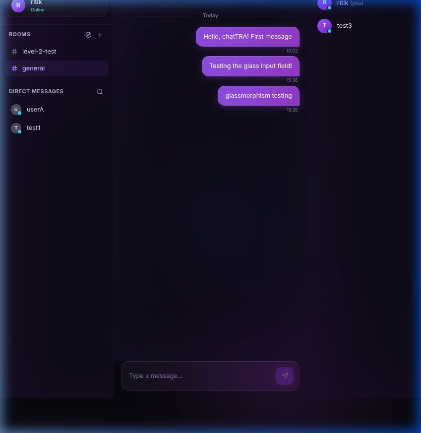

# ✨ GapShap — Premium Real-Time Glassmorphism Chat (Client)

<div align="center">
  
  <br />
  
</div>

<br />

This directory contains the frontend React application for **GapShap**, built with Vite, TailwindCSS, and Socket.IO-client.

---

## 💎 The Glassmorphism Design System

Unlike traditional flat dark-mode applications, GapShap is engineered around a spectacular **Glassmorphism design language** that emphasizes depth, refraction, and dynamic lighting:

* **Living Canvas Backdrop**: The entire application floats above an ambient, animated canvas featuring drifting radial-gradient orbs (`float` physics) and a continuous 14-second `breathe` hue-rotation cycle.
* **Asymmetric Border Lighting**: Every panel simulates physical frosted glass (`backdrop-filter: blur(20px) saturate(180%)`) with top-left specular highlights and subtle bottom-right shadows, mimicking a natural top-down light source.
* **Tactile Message Physics**: Messages are treated as individual glass objects. Sent messages feature a vibrant purple-gradient glass tint (`msg-own`), while received messages use a clean white-frosted tint (`msg-other`). Hovering over any message lifts it against gravity (`translateY(-2px)`) with a directional glow.
* **Interactive Focus Rings**: The message input bar is a sleek frosted panel that springs forward on focus, gaining a glowing purple border ring and deep drop shadows to provide immediate, satisfying tactile feedback.
* **Flawless GPU Compositing**: Completely isolates background filter animations from the active UI layer, preventing WebKit/Blink rasterization conflicts and ensuring butter-smooth 60fps rendering.

---

## ⚡ Core Features & Architecture

### 💬 Multi-Room & Direct Messaging Infrastructure
* **Public Chat Rooms**: Users can create, browse, and join persistent, topic-based public chat rooms. Each room maintains its own isolated real-time socket broadcast channel and message history.
* **Instant Direct Messaging (DMs)**: Private 1-on-1 messaging threads feature real-time unread notification badges and instant participant state synchronization.
* **Global User Discovery**: An integrated **User Browser** modal allows users to search the entire registered database instantly by username and initiate private conversations with a single click.

### 🚀 High-Performance Real-Time Engine (Socket.IO)
* **Zero-Lag Mutable Ref Pattern**: To prevent React re-render cycles from dropping active WebSocket connections, socket listeners utilize advanced mutable ref bridging. This guarantees zero dropped messages even when rapidly switching between active rooms and DMs.
* **Live Typing Indicators**: Broadcasts real-time typing events (`typing_start` / `typing_stop`) across rooms and DMs, displaying animated, non-intrusive typing pills to keep conversations feeling active and alive.
* **Instant Online Presence**: Dynamically tracks user disconnects and reconnects, keeping the right-hand `UserList` panel perfectly synchronized with active online counts.

### 🛡️ Bulletproof Frontend & Security
* **Rock-Solid Viewport Locking**: Engineered to bypass browser GPU compositing conflicts and flexbox collapse bugs, ensuring the UI stays rigidly locked to 100% viewport dimensions without unwanted scrollbars or clipping.
* **JWT Authentication**: Secure, token-based authentication flow with automated session cleanup on logout to prevent memory leaks or stale state caching.
* **100% Linter Compliant**: Completely clean, zero-warning codebase adhering to strict ESLint and React best practices.

---

## 📂 Frontend Directory Structure

```text
client/
├── src/
│   ├── components/     # Glassmorphism UI Components (Sidebar, ChatWindow, etc.)
│   ├── hooks/          # Custom React Hooks (useSocket, useTyping, etc.)
│   ├── index.css       # Core Design Tokens & Glass Utilities
│   ├── main.jsx        # React Application Entry Point
│   └── App.jsx         # Main Application & Stacking Context Controller
├── index.html          # HTML Entry Point & Document Title
├── vite.config.js      # Vite Bundler Configuration
└── tailwind.config.js  # Tailwind Theme & Custom Animations
```

---

## 🛠️ Development Setup

### 1. Install Dependencies

```bash
npm install
```

### 2. Run Dev Server

```bash
npm run dev
```

Open your browser and navigate to [http://localhost:5173](http://localhost:5173).

---

## 📜 License

This project is licensed under the MIT License.
